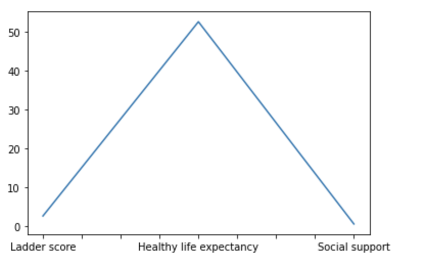
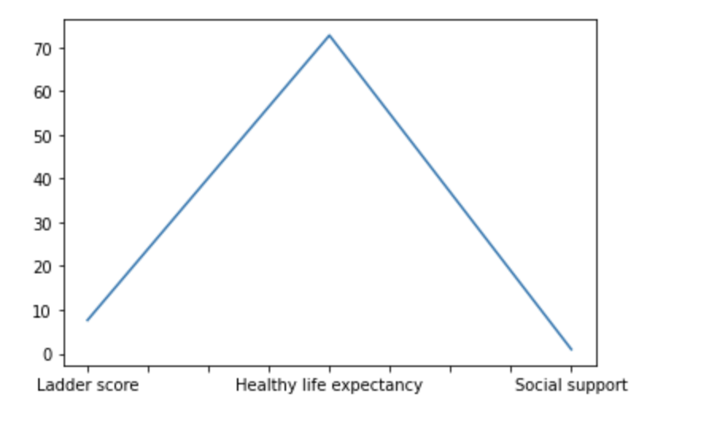
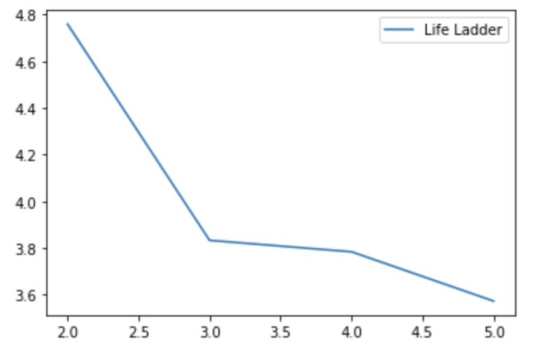

# CSV Project

## Data: World Happiness Report

Medium Post: https://vladyslav-nykoliuk.medium.com/the-world-happiness-report-analysis-2fe0ba4f1b4b

Assumptions:

1. People in coutries of smaller population tend to be happier than those with a large population count
2. Countries in Europe have the highest happiness score whereas countries in Africa have the least
3. Countries with a higher level of social support and freedom to make life choices had a greater life expentancy and overall happiness level than countries with the opposite

Analysis:

Sample country in Africa

Sample country in Europe

Sample life ladder for a country with high population

